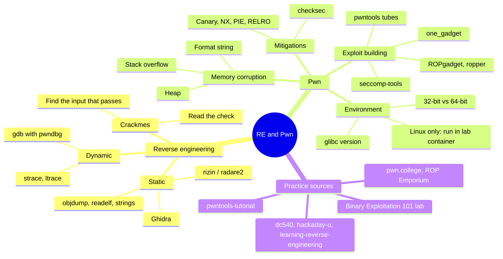

# Brainstorm: challenge categories and tools

```mermaid
mindmap
  root((RE and Pwn))
    Reverse engineering
      Static
        Ghidra
        rizin / radare2
        objdump, readelf, strings
      Dynamic
        gdb with pwndbg
        strace, ltrace
      Crackmes
        Read the check
        Find the input that passes
    Pwn
      Memory corruption
        Stack overflow
        Format string
        Heap
      Mitigations
        checksec
        Canary, NX, PIE, RELRO
      Exploit building
        pwntools tubes
        ROPgadget, ropper
        one_gadget
        seccomp-tools
      Environment
        32-bit vs 64-bit
        glibc version
        Linux only: run in lab container
    Practice sources
      pwntools-tutorial
      Binary Exploitation 101 lab
      dc540, hackaday-u, learning-reverse-engineering
      pwn.college, ROP Emporium
```
