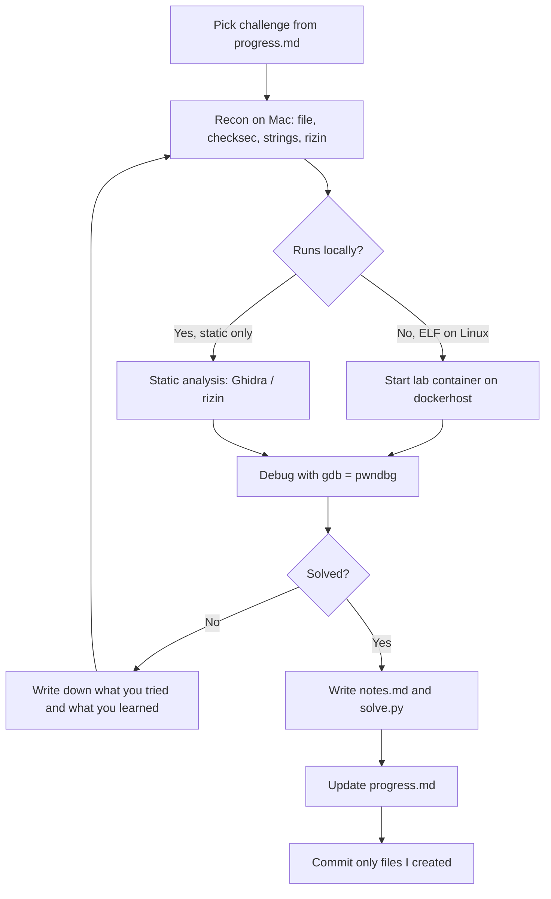

# Daily workflow

```mermaid
flowchart TD
    A[Pick challenge from progress.md] --> B[Recon on Mac: file, checksec, strings, rizin]
    B --> C{Runs locally?}
    C -- No, ELF on Linux --> D[Start lab container on dockerhost]
    C -- Yes, static only --> E[Static analysis: Ghidra / rizin]
    D --> F[Debug with gdb = pwndbg]
    E --> F
    F --> G{Solved?}
    G -- No --> H[Write down what you tried and what you learned]
    H --> B
    G -- Yes --> I[Write notes.md and solve.py]
    I --> J[Update progress.md]
    J --> K[Commit only files I created]
```
